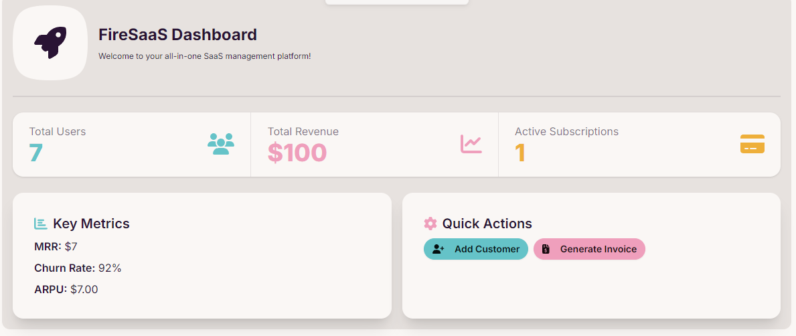

# Setting Up an Admin User

To set yourself as an admin user in FireSaaS:

1. Create an account through the normal signup process in the application.
2. Go to your Firebase Console and navigate to the Firestore Database.
3. Find the `users` collection and locate your user document (it should match your UID).
4. Edit the document and add a new field:
   - Field name: `isAdmin`
   - Field value: `true` (boolean)
5. Save the changes to the document.

Now, when you log in to the application, you should have access to the admin dashboard.

# Admin Dashboard

The admin dashboard provides powerful tools for managing your SaaS application. To access it, log in with an admin account and navigate to the admin section.

To see the dashboard, navigate to `<your-domain-or-localhost>/admin`

## Features

1. **Real-time Stripe Data**:
   The dashboard pulls live data from Stripe, giving you an up-to-date overview of your business metrics:

   - Total Customers
   - Total Revenue
   - Active Subscriptions
   - Monthly Recurring Revenue (MRR)
   - Churn Rate

2. **Manual Customer Addition**:
   Easily add new customers directly from the dashboard:

   - Click the "Add Customer" button
   - Enter the customer's email address
   - The customer will be created in Stripe and added to your customer list

3. **Invoice Generation**:
   Create and send custom invoices to your customers:
   - Click the "Generate Invoice" button
   - Select a customer from the dropdown
   - Enter the invoice amount and due date
   - The invoice will be created in Stripe, and you'll receive a link to the hosted invoice page

## Implementation Details

The admin dashboard functionality is primarily implemented in the `AdminDashboard` component:
`/src/components/admin/AdminDashboard.tsx`

This component handles fetching dashboard data, managing customers, and generating invoices through various API endpoints.

By leveraging these admin features, you can effectively manage your SaaS application, track key metrics, and perform important administrative tasks directly from your FireSaaS dashboard.
