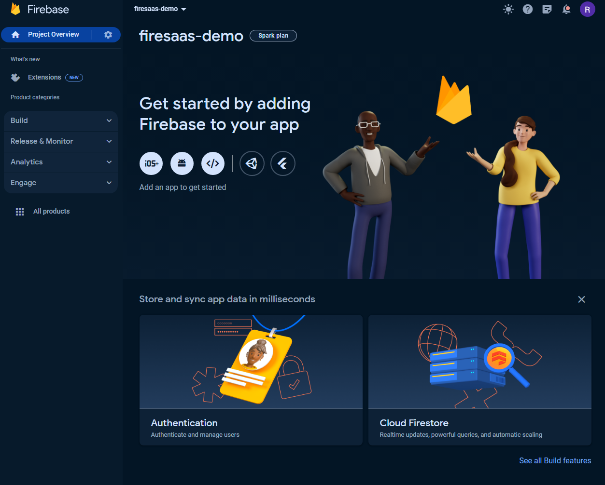
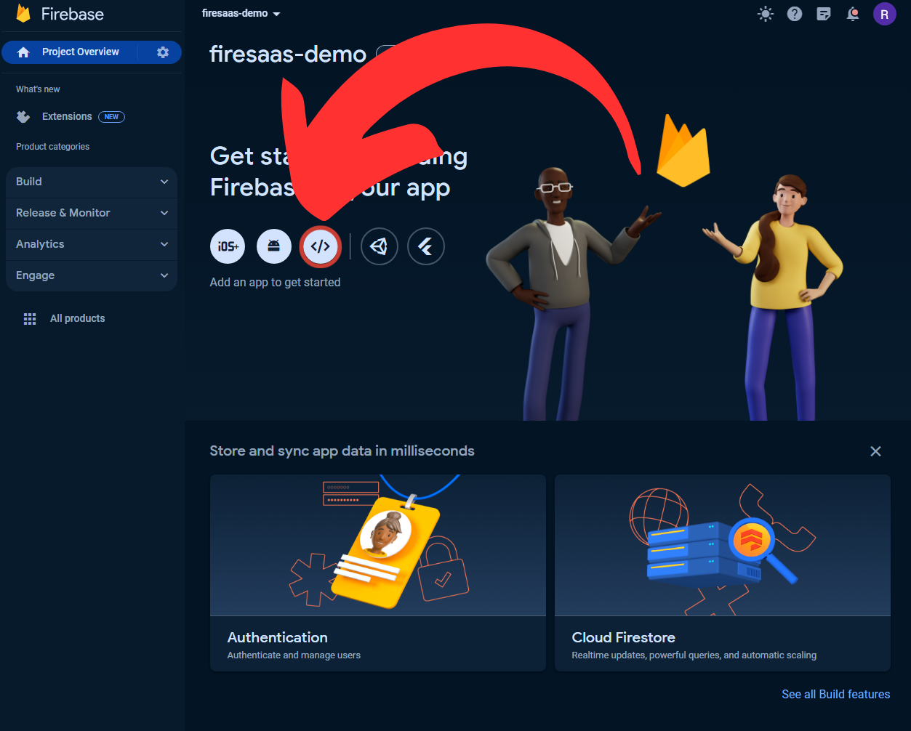
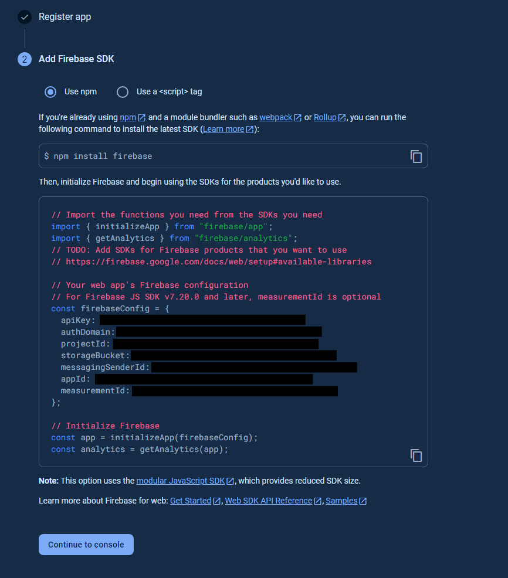
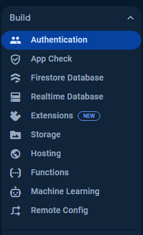
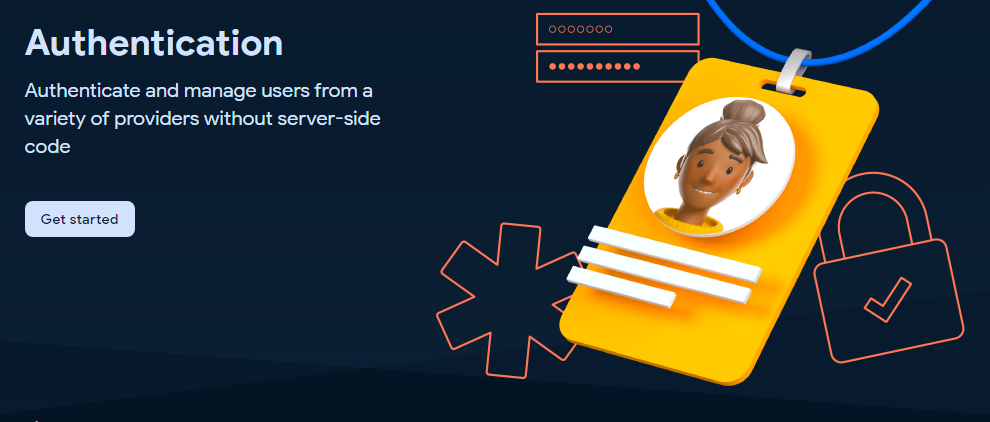
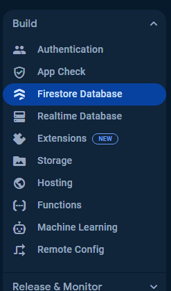
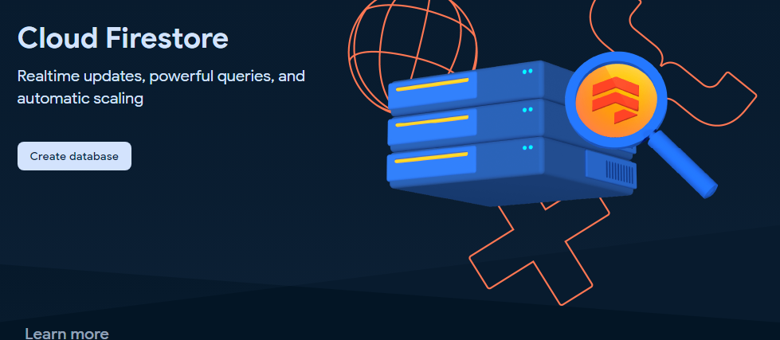
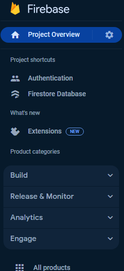
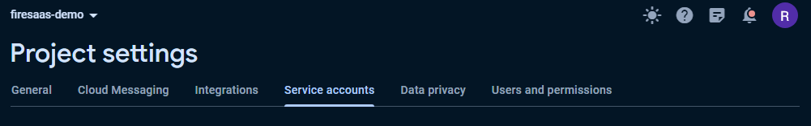
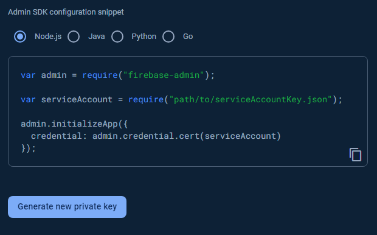

import { Callout } from "nextra-theme-docs";

# FireSaaS Setup Guide

This guide provides a step-by-step process for setting up your FireSaaS project. It includes configuring Firebase, deploying functions, setting up Stripe, and finalizing your project settings.

## Table of Contents

- [Create a New Firebase Project](#Create-a-New-Firebase-Project)
- [Copy Firebase Config Environment Variables](#copy-firebase-config-environment-variables)
- [Enable Authentication and Firestore](#enable-authentication-and-firestore)
- [Create Firebase Admin Service Account](#create-firebase-admin-service-account)
- [Adding Project ID](#adding-project-id)

---

## Firebase Configuration

### **Create a New Firebase Project**

Start by creating a new project in Firebase.

Once you have a new project open on Firebase it'll look something like this



---

### **Copy Firebase Config Environment Variables**

Click on the web button here



It will ask you to give your app a name, name it whatever you like

<Callout emoji="📣">
  {" "}
  This project is setup to be hosted on Vercel, not Firebase hosting. Leave it unchecked
  for now unless you specifically want to host it on Firebase
</Callout>

Then you will get the Add Firebase SDK screen, it will show you your Firebase Config, these values need to be added to the .env



Copy paste each value that I've blacked out and move it into your match variable in the .env.

---

### **Enable Authentication and Firestore**

Next you'll want to enable Auth and Firestore in Firebase. To do that just click on the Authentication option in the sidebar menu on the left.



And click the Get Started button on the page



We'll start by enabling Email / Password Auth and Google Auth because they are the easiest to implement.

Click Email/Password under the Sign-in method tab of the authentication page.

Now Click Save

You'll now see an Add new provider button, click it to enable Google Auth

Choose Google from the list of additional providers.

Click the enable toggle to enable.

Choose a public facing name for you project (Your users will see this, just name it your app's / company's name)

and configure a support email for the project (most likely just your email already connected to firebase.)

Auth is done, now go setup Firestore



Now click the Create Database button



Set the location to the most appropriate location for your users (or just leave it on the default)

Go ahead and start in test mode for now, this will leave your db open to reads and writes until a specific date. You can define more specific rules later.

---

### **Create Firebase Admin Service Account**

The last step is setting up firebase admin by creating a service account and copy pasting the service account values into your .env

Click settings gear in project overview in the top left and click Project Settings



Click the Service Accounts tab



Click Generate new private key



This will download a JSON file containing your key information. The easiest way to use this private key in my opinion is to open it up in a text editor and copy paste the important values we need to setup Firebase Admin into your .env

Open the file and copy the entire private_key value and the client_email value into your .env

---

### **Adding Project ID**

Finally we have to open the `.firebaserc` file inside the project.

Add your project id here, you should have your project id in your Environment Variables already so copy it from there.

```JSON
// .firebaserc
{
  "projects": {
    "default": "<PROJECT-ID-HERE>"
  }
}
```

That's all the Firebase Specific env vars.
